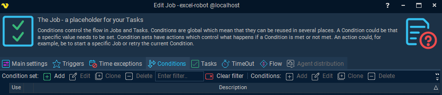
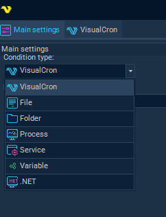
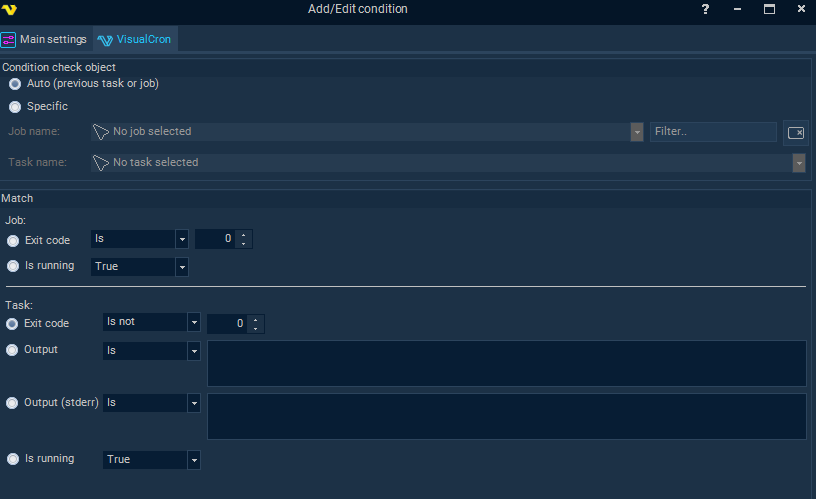

## Conditions

In VisualCron RPA, **Conditions** are logical checks that determine whether a task or job should proceed, branch, or terminate. They are part of the flow control mechanism and are essential for building intelligent, responsive automation workflows.

### Conditions in the Workflow

Conditions follow Triggers in the automation workflow for RPA jobs. 

Trigger -> **Condition** -> Task -> Notification

### Condition Details

Conditions are grouped into condition sets, which include:

* A description
* One or more conditions
* Actions based on whether conditions match or not (e.g., continue, exit, skip)

Each condition has:

* A type (e.g., VisualCron, File, Folder, Process, Variable, .NET)
* A description
* A flag for whether it is active
* Parameters specific to the condition type

### Common Condition Types

* VisualCron: Checks internal values like task exit codes, task output, or whether a task/job is running.
* File/Folder: Checks for existence, size, or modification time.
* Process: Verifies if a specific process is running.
* Variable: Compares values of defined variables.
* .NET: Executes custom .NET logic for advanced scenarios.

### Match Logic

Conditions use match types to evaluate outcomes:

* MatchAll: All conditions must be true to proceed.
* MatchNone: If none are true, a fallback action is triggered.
* MatchAny: If any condition is true, the associated action runs.

Example:
If a task’s exit code is 0 (success), the next task continues. If not, the job exits or branches based on the defined action

You can define conditions in the Global > Conditions dialog within the VisualCron Client UI. Here's how:

### Create a Condition Set

#### Add a Condition within the Job

Within the Job, navigate to **Conditions > Add/Update Condition**. This is where you define the logic that governs task execution.

#### Choose Condition Type

#### Define Logic

