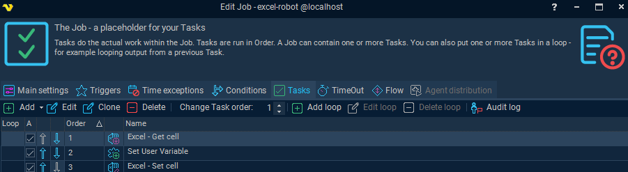
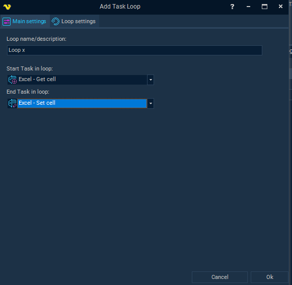
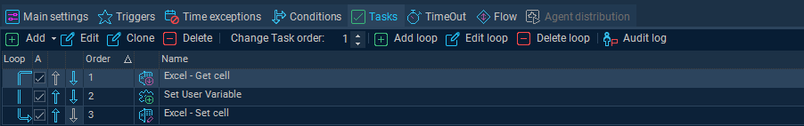

## Loops

VisualCron supports several loop types to automate repetitive tasks:

### Loop Types

#### For Loop
Executes a task a specific number of times using numeric start and end values (e.g., from 1 to 100).

#### While Loop
Continues execution as long as a condition is true. Useful for dynamic checks like “while file exists” or “while value < threshold.”

#### Do While Loop
Similar to While, but guarantees at least one execution before checking the condition.

#### For Each Loop
Iterates over a list of items—such as rows in a spreadsheet or lines in a string.

#### Flow / Label / Go To
These allow more advanced control, such as jumping to specific labeled tasks or breaking out of loops based on conditions.

#### End Loop / Continue Loop

* End Loop stops the loop entirely.
* Continue Loop skips the current iteration and starts the next—ideal for exception handling.

These loop types are configured within the VisualCron Job Task interface, where you define start/end tasks and loop conditions.

### Configuring Loops

#### Defining Loop Boundaries​

Set start and end tasks to encapsulate actions within a loop for clear execution boundaries.​

#### Setting Loop Conditions​

Loop conditions include numeric ranges, booleans, or list iterations to control loop execution flow.​

#### Using Variables and Expressions​

Dynamic loop configuration uses variables and expressions for adaptable and responsive automation workflows.​
#### Loop Settings Interface​

The loop settings interface allows selection of loop types and input of relevant parameters easily.

### Exception Management

#### Error Logging​

VisualCron logs errors during loop execution, aiding in troubleshooting and improving reliability.​

#### Conditional Failure Handling​

Using conditional branches allows skipping problematic data or retrying failed tasks gracefully.​

#### Retry Logic Implementation​

Retry logic in loops enables multiple task attempts before exiting, enhancing workflow resilience.

### Basic Loop Logic Example

Select to Add a Loop to the Task flow

Configure the Loop logic

Verify the Loop exists in the Task flow and test with Trigger and Conditions if necessary.

### Best Practices

#### Avoid Infinite Loops​

Set clear exit conditions to prevent loops from running endlessly and causing system issues.​

#### Modularize Loop Logic​

Break loop logic into modules to improve readability and make maintenance easier.​

#### Monitor Nested Loops​

Keep track of performance impact as nested loops can consume significant system resources.​

#### Use Descriptive Naming​

Document loop behavior with clear variable names and comments to enhance understanding.