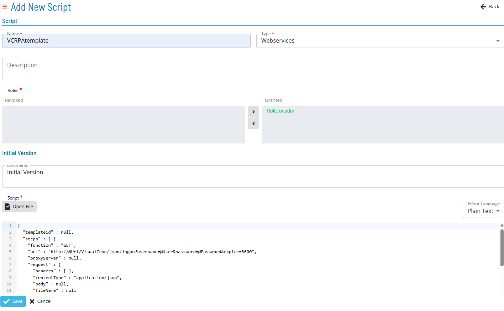

# Orchestrating with OpCon

To build an OpCon Schedule and Job to orchestra RPA through VisualCron, there are a few steps that must be taken prior to setting up the job.

- To run a VisualCron RPA job through OpCon requires the use of the Web Services Connector. This can be installed by following the instructions in the [RPA documentation](https://help.smatechnologies.com/opcon/agents/opcon-rpa/orchestration-with-opcon-visualcron-rpa).

## In VisualCron

In VisualCron Settings, under the **Web  API** tab, make sure that **Allow Web API** box is checked.

1. Create and configure the RPA job.
2. Save and publish the job so that OpCon can access it.

## In OpCon

### Install and verify connector or agents

1. Install or verify installation of the required components.
    - If using [Relay](https://help.smatechnologies.com/opcon-relay/#install) for OpCon Cloud, ensure that the Agent and plugin file are installed and configured.
    - If using Web Services connector, follow the instructions that follow.

2. Install and configure the Web Serivices Connector
    - Instructions for installation can be found in the [Web Services Connector documentation](https://help.smatechnologies.com/opcon/connectors/webservices/installation).
    - The Connector can be downnloaded with the [OpCon Web Installer](https://github.com/smatechnologies/opcon-web-installer/releases/).

3. Create a New Web Services **Script Type** and **Script Runner**

#### Script Type

#### Script Runner

4. Add the RPA Web Services Script (a template is provided in [RPA Documentation](https://help.smatechnologies.com/opcon/agents/opcon-rpa/orchestration-with-opcon-visualcron-rpa#opcon-rpa-web-services-script))

### Create an OpCon Schedule and Job

1. Create a Schedule to orchestrate the RPA job.

2. Create the OpCon job to orchestrate the RPA job.

3. Use the embedded Web Services script.

4. Set Failure Criteria - Exit Code `200=Finish OK`.

5. Provide the variables required for the Web Services connection.

There are four basic environmental variables required for the provided template:
- `@Url`
- `@User`
- `@Password`
- `@Jobname`

The values for these variables should be taken from the VisualCron user, server, and job settings. 

6. Set a Frequency within the job.

7. Build the job to release and run to test the workflow.

