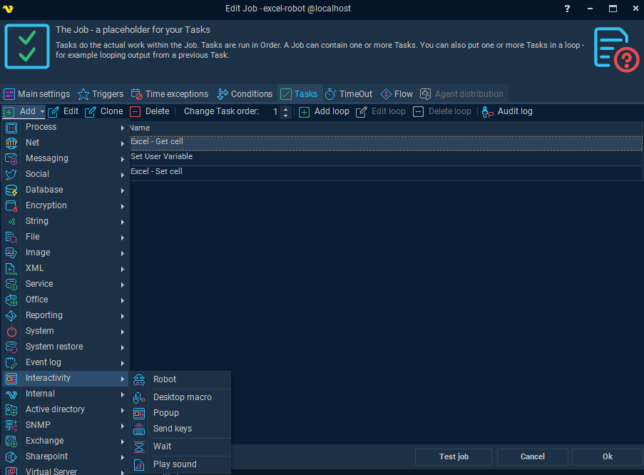
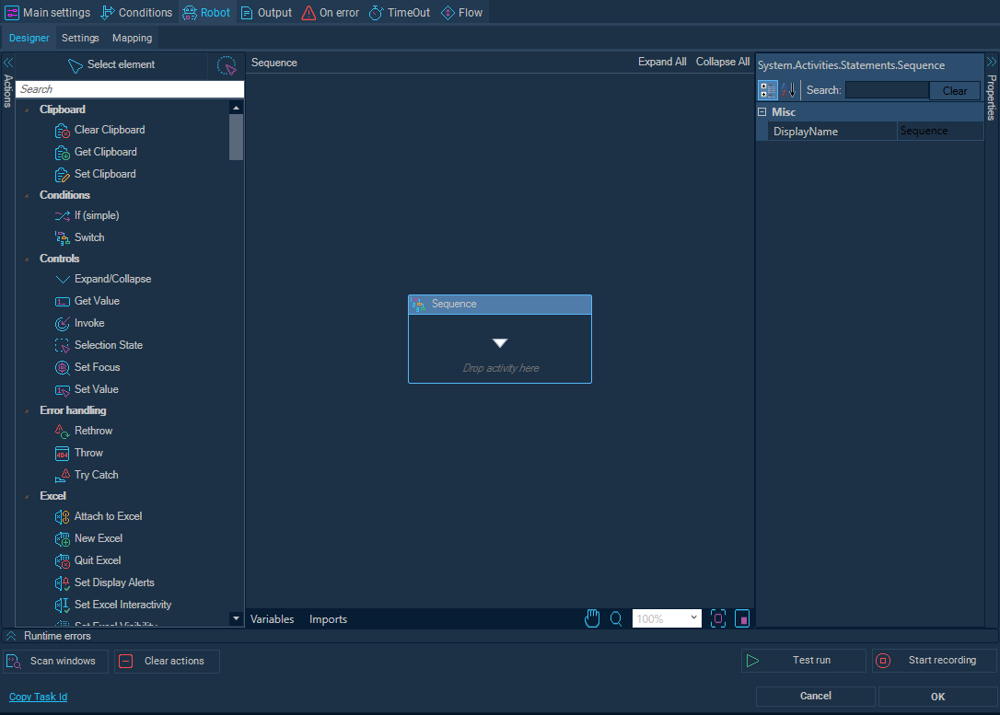

## Robot Tasks

### Robot Task Definition

RPA **Robot tasks** are a type of automation that mimics human interactions with desktop and web applications. These tasks are designed to automate manual, repetitive actions such as mouse movements, keystrokes, and clicks.

RPA Robot tasks are typically used for desktop automation and require foreground execution. They simulate user behavior and interact directly with applications like Outlook or browsers. Because they need to launch and control applications, they cannot run in the background..

They are configured within the VisualCron environment and can be used to:

* Record and replay user actions on desktop or web interfaces.
* Automate workflows that require human-like interaction.
* Execute tasks in either foreground (visible to the user) or background, depending on the task type and system limitations.

:::info Note

The RPA desktop recorder will take full control of the host system in order to execute the workflow.

A dedicated machine is preferred for executing the playback of desktop rpa tasks in order to ensure sufficient resources are available and that the recording and playback of tasks do not interfere with the management of other critical operations.

RPA desktop tasks can only support recording workflow on the host system which VisualCron is installed.

The RPA desktop recorder does not currently support the ability to replay workflow recorded on a remote virtual machine.

:::

### Creating a Robot Task

#### To Create a Robot Task in VisualCron

Within the Job screen, select the **Tasks** tab, click the **Add** button and select **`<task type`> --> `<desired action>`**.

In the **Task** screen, click the `<desired action>` tab

Each task will have its own settings and configurations for execution.

Configure execution settings such as background/foreground execution, session type, and
credentials if needed.

When using the generic **Interactivity - Robot** task, the task can be set up using the recording tool or by dragging and dropping actions into the Sequence menu.

