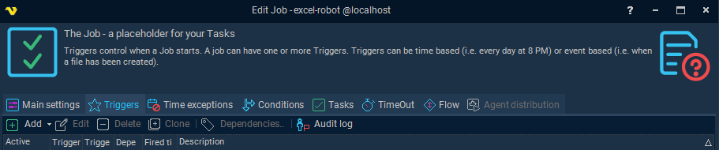
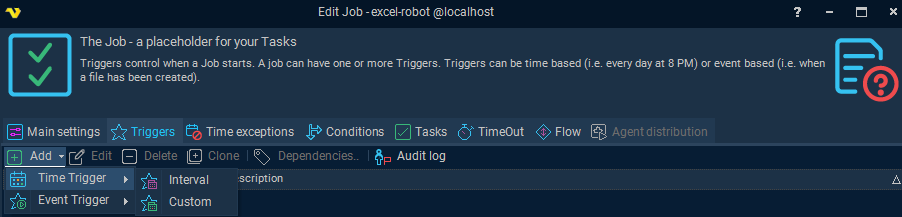
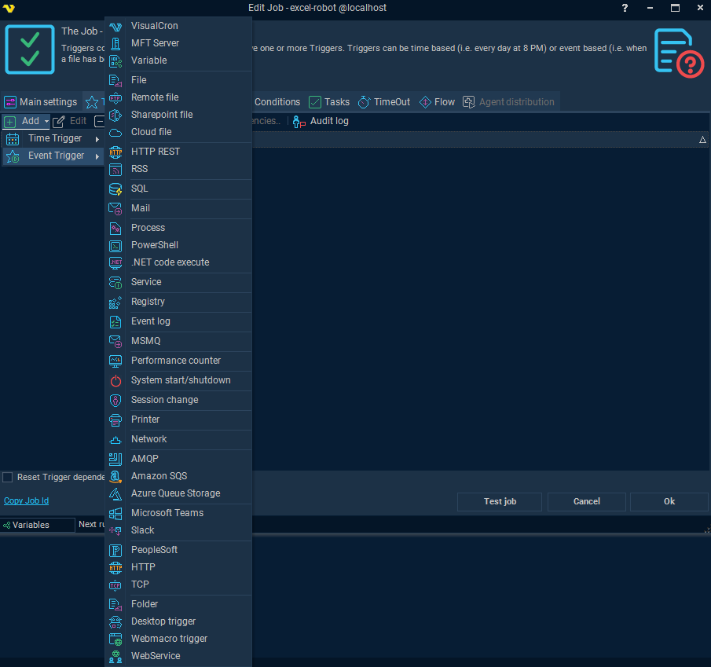
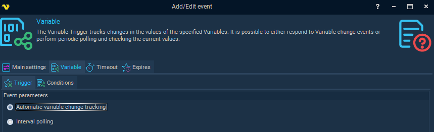

## Triggers

In VisualCron, triggers are mechanisms that initiate the execution of a job. They can be based on:

* Time (e.g., every minute, daily at 9 AM)
* System Events (e.g., file creation, process start, service status change)

Triggers are configured within each job and can be used individually or in combination. 

By default, triggers operate in an “OR-matter”, meaning any one trigger firing will start the job. However, you can configure dependencies so that multiple triggers must fire before the job starts.

### Triggers in the Workflow

Triggers begin the automation workflow for RPA jobs. 

**Trigger** -> Condition -> Task -> Notification

### Adding a Trigger

#### Within the Job, Add a Trigger

#### Select and Add a Trigger Type

##### Time-based Triggers

##### Event-based Triggers

### Advanced Trigger Use in RPA Workflows

VisualCron supports event-driven RPA orchestration, especially when integrated with OpCon:

* Use global variable triggers to initiate playback of RPA tasks.
* Combine triggers with conditions to gate execution based on system state or variable values.
* Triggers can be used to monitor file systems, track process changes, or respond to service status updates.

### Orchestration with OpCon

In hybrid setups using OpCon to orchestrate automation:

* OpCon can update a variable in VisualCron, which then triggers an RPA job.
* This allows centralized orchestration and status tracking across platforms.

