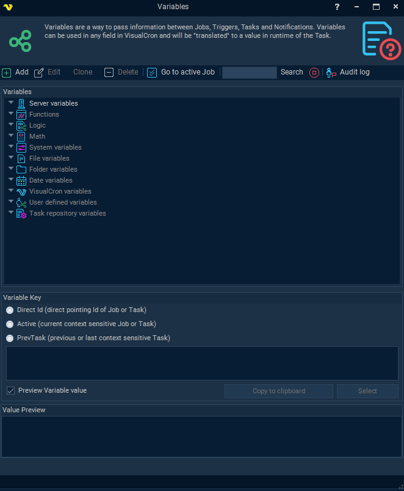
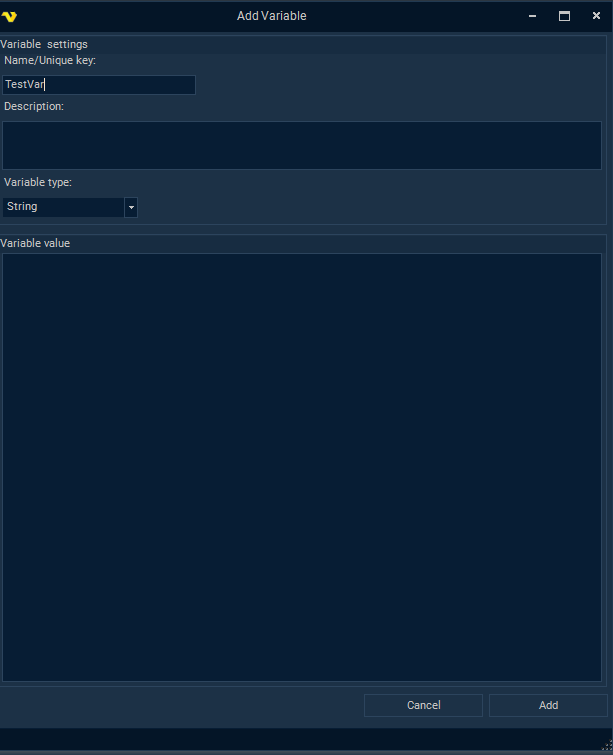
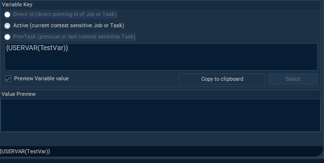

## Variables

Variables in VisualCron are dynamic placeholders that allow you to reuse and adapt data across tasks and jobs. Instead of hardcoding values like file paths, usernames, or passwords, you define them once as variables and reference them wherever needed. This approach improves maintainability, reduces errors, and simplifies updates.

:::warning Warning

Note that the syntax of a VisualCron variable and an OpCon variable differ significantly!

**VisualCron** variable syntax: `{VarType(VarName)}`
- Example: `{USERVAR(TestVar)}`

**OpCon** variable syntax: `[[VarName]]`
- Example: `[[TestVar]]`

:::

### Variable Types

#### Job Variables

Defined within a specific job.
Can be referenced inside or outside the job.
Created/edited via the Edit Job screen.
Stored locally to the job but visible in the Variables browser.

#### Global Variables

Accessible across all jobs.
Managed from the main menu: Server > Global objects > Variables.
Useful for shared values like environment paths or credentials.

#### System Variables

Automatically populated with system-level data (e.g., memory usage, uptime).
Useful for logging, monitoring, or conditional logic.

#### Date/File Variables

Provide formatted date/time or file-related data.
Can be customized using delimiters and formatting functions.

### Using Variables

* Most fields in VisualCron support variables. If a field turns light blue when dragging a variable over it, it accepts variables.
* Use the Variables button in the status bar or the **Job > Main Settings > Job Variables** section.
* Use curly braces {} to insert variables, e.g., {USER(username)}.
* You can override job variables using the Job/Task Control Task.

#### Use in API Calls and Return Variables
* Use tokens and job IDs as variables in API calls.
* Capture return values using `JobVariableValue/Get` endpoints.

### User-defined Variable Example

* Add a User-defined Variable by clicking the **Variables** tab in the bottom of the Job screen
* Click **Add** to Add a User-defined Variable

* Name and configure the User-defined Variable

* In the Variable list screen, notice the context and syntax of the new User-defined Variable

