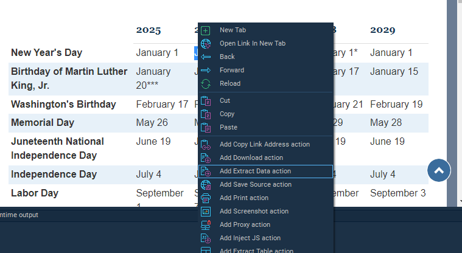

## Web Macro Tasks

### Web Macro Task Definition

Web Macro Tasks are designed to automate interactions with websites using the built-in 
browser in the RPA Tray Client. They allow users to navigate web pages, extract data, and 
perform actions such as clicking buttons or entering text.

#### To create a Web Macro task in VisualCron:

Within the Job screen, select the **Tasks** tab, click the **Add** button and select **Net --> Web Macro**.

When the built in browser screen appears, enter the URL to navigate to and perform the desired actions within the browser.

To record actions, click the **Record** button at the bottom of the Web Macro Task screen.

The Web Macro will capture each step and generate corresponding actions. 

To select a desired element within the page, right-click on the element and select the desired action and type of data to extract.

For Web Macro Tasks that include data capture:
* Right-click on the object to be captured and select the element that will be extracted.

* Navigate to the **Destination** tab, select the desired Job Variable or User Variable.

Stop the recording and save.

### Important Information and FAQs

**Q: Can I use Chrome or Edge instead of the built-in browser?**

A: No. The Web Macro Task uses its own built-in browser. Chrome and Edge are not 
supported for automation within this task type

**Q: What if the website I’m automating uses pop-ups or redirects?**

A: You can configure browser settings in the Web Macro Task to block pop-ups or allow redirects. These options are available in the task's settings panel.

**Q: Can I automate login processes that use multi-factor authentication (MFA)?**

A: Yes, but it depends on how the MFA is implemented. Some MFA flows can be automated 
using keystroke actions or conditional logic, while others may require manual intervention 
or advanced scripting.

**Q: How do I handle dynamic web elements that change each time the page loads?**

A: Use HTML element attributes like class names or IDs that remain consistent. The 
recorder helps identify these elements, and you can fine-tune the selectors if needed.

**Q: Can I reuse recorded actions in other bots?**

A: Yes. You can export and import bots using ZIP files, allowing you to reuse recorded 
sequences across different environments or tasks.