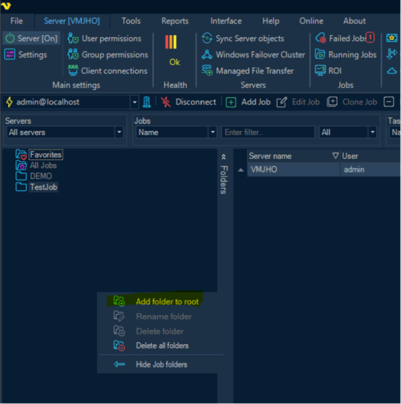
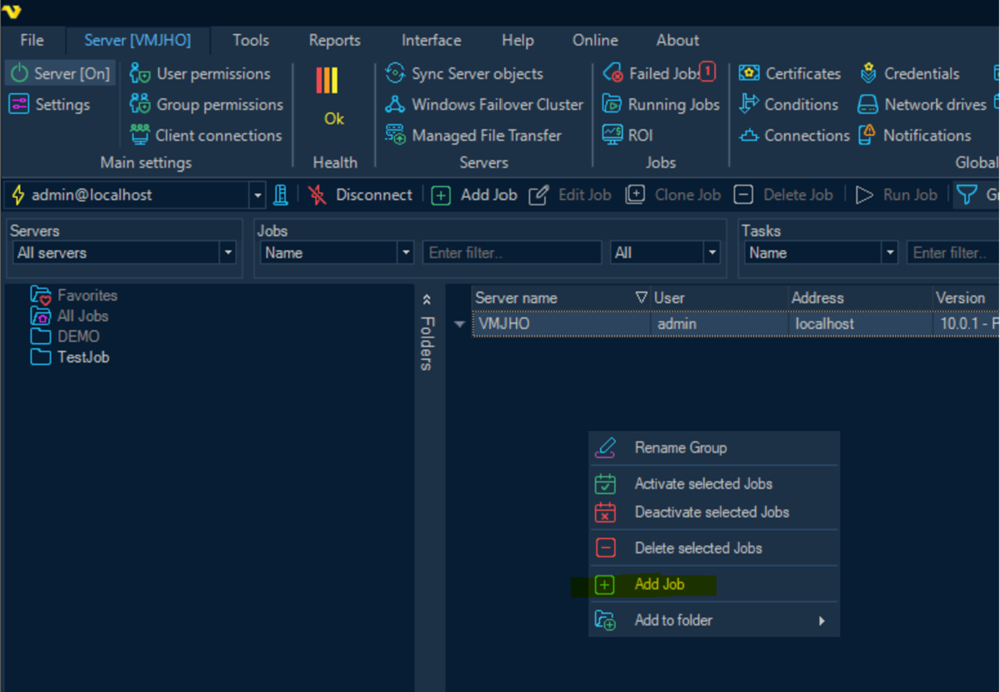
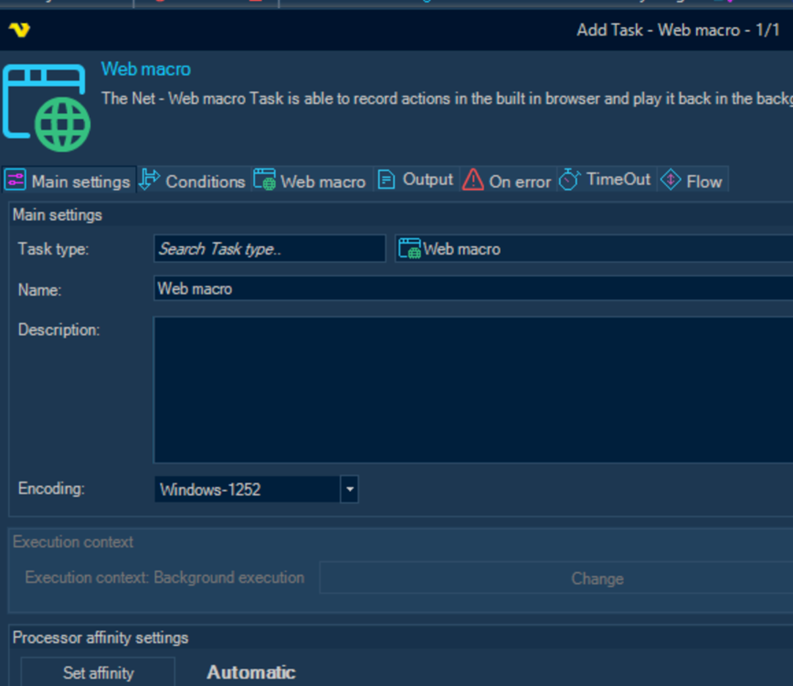
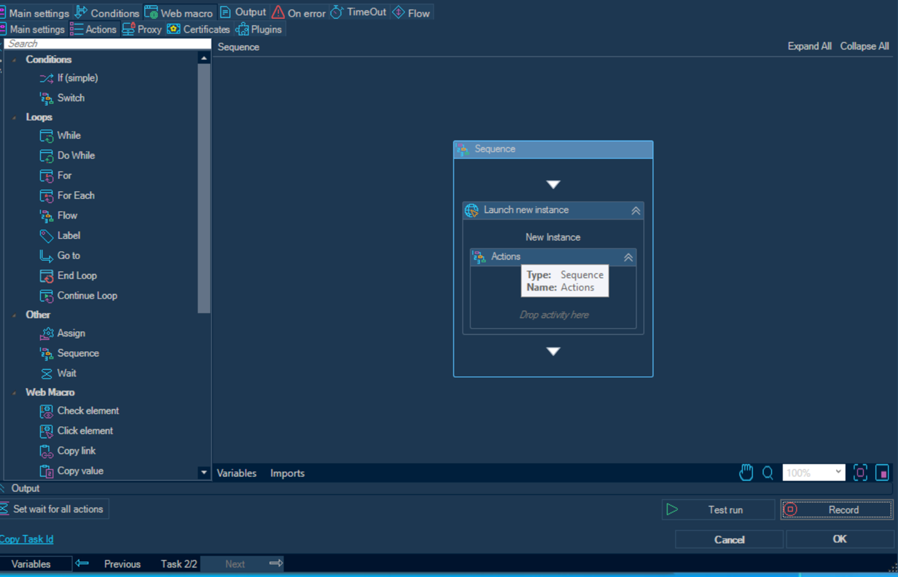
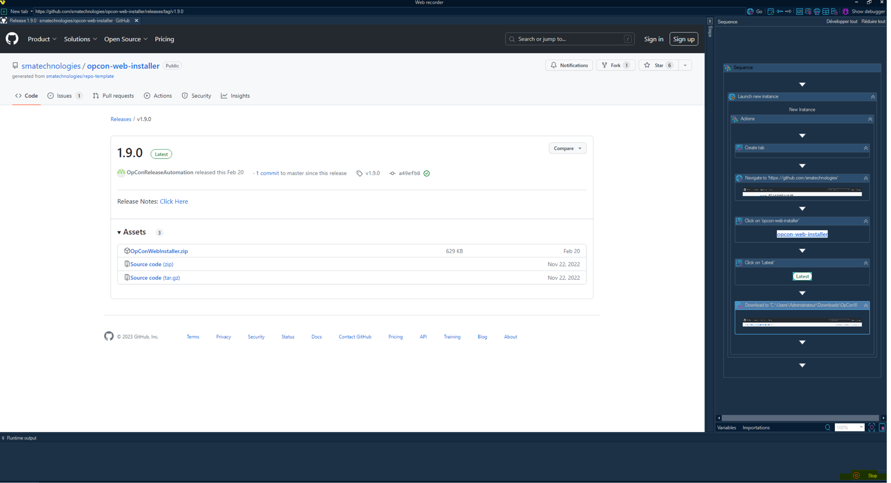
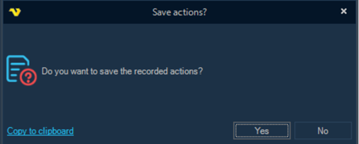
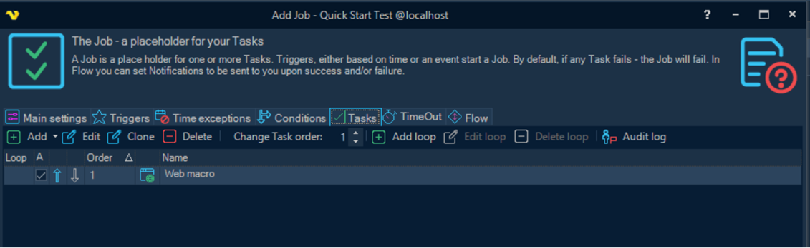

# Creating a Web Macro Task

On the left, right-click and create a ‘container’ (Add folder to root) to categorize the workflow to be created.  

For Ex: TestJob

Toward the top, click **Add Job**

Name the Job

Ex: **Quick Start Test**

Select the **Tasks** tab

Click **Add > Net > Web Macro**

Select the **Web Macro** tab

Select the **Actions** tab

Select **Record** (Bottom right-hand corner of the window)

Enter the desired URL at the top and  browse to the page

As you click through the webpage, a blue outline around the selected object will indicate that the step is saved. You will see the steps populate in the right Sequence frame as they are clicked.

Modify the folder and other parameters if necessary and click **OK**.

Click the **Stop** button in the bottom right hand corner of the client to stop the recording.

Select **Yes** to save the recorded actions.

Click on **Test Run** to test the workflow.

Verify that the expected file was downloaded during the worklfow test run.

The Job and task are now saved to your queue.

