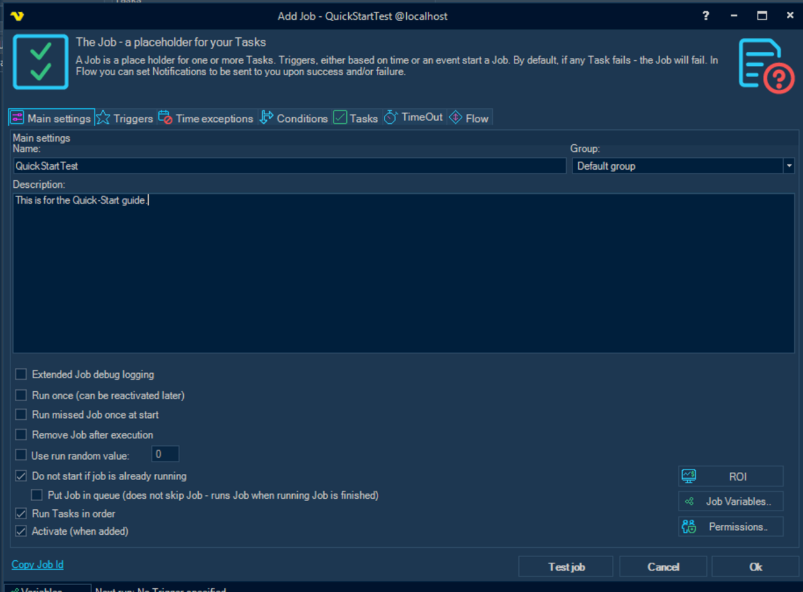
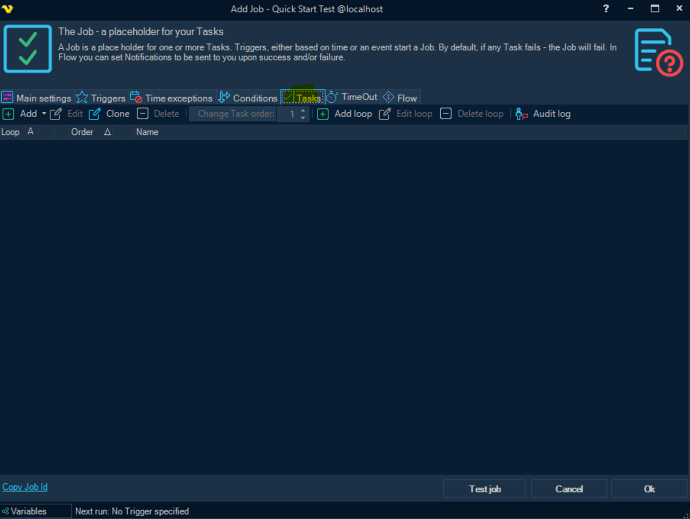
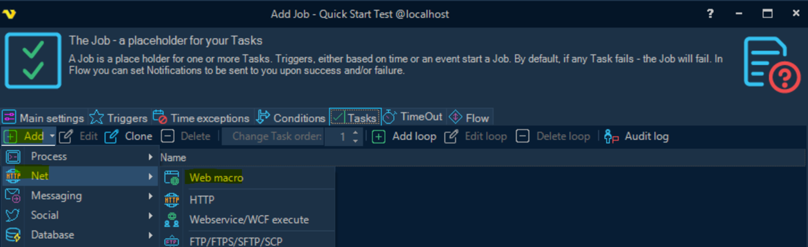
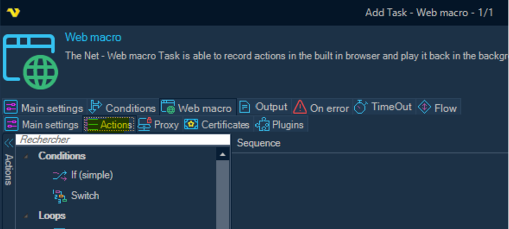
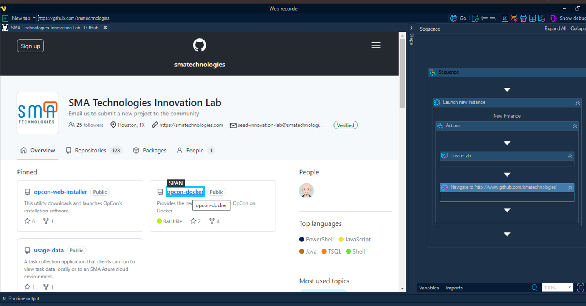
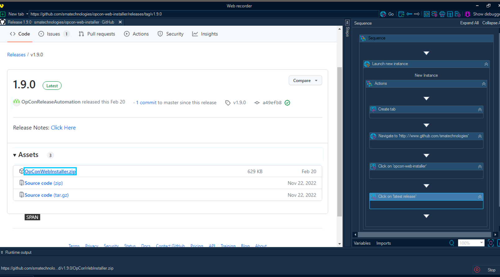
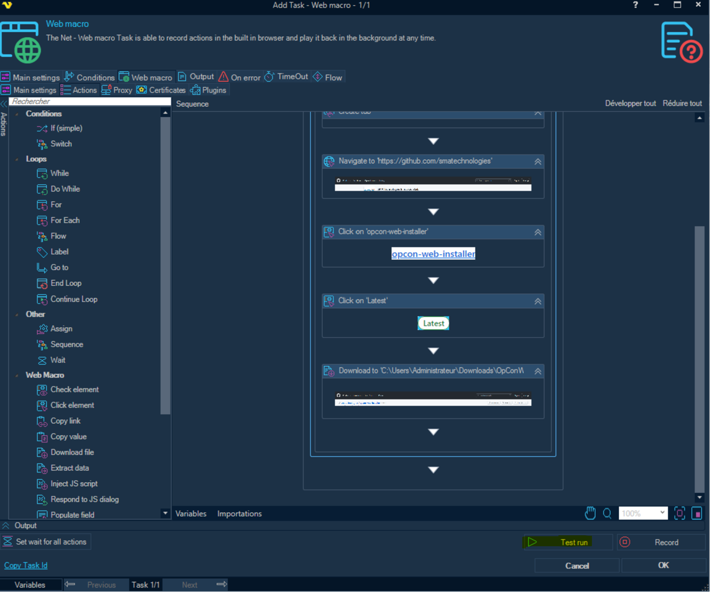
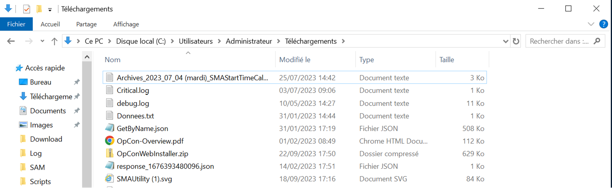

# Web Macro - Download File

Use an RPA Web Macro to download a file from a website

:::tip [Walkthrough Video](../static/img/vs-web-macro-download-file.mp4)

:::

## Instructions 

1. On the left, right-click and create a ‘container’ (Add folder to root) to categorize the workflow to be created. Name the folder as **TestJob**

2. Toward the top, click **Add Job**

3. Name the Job as **Quick Start Test**

4. Select the **Tasks** tab

5. Click **Add > Net > Web Macro**

6. Select the **Web Macro** tab

7. Select the **Actions** tab

8. Select **Record** (Bottom right-hand corner of the window)

9. Enter the desired URL at the top and  browse to the page

10. As you click through the webpage, a blue outline around the selected object will indicate that the step is saved. You will see the steps populate in the right Sequence frame as they are clicked.
    - In this case, we are navigating to `https://github.com/smatechnologies`.
    - Next click on the **opcon-web-installer** link.
    - Scroll to and click the **latest release** link.
    - Click the **OpConWebIntaller.zip** file link.

11. Modify the folder and other parameters if necessary and click **OK**.

12. Click the **Stop** button in the bottom right hand corner of the client to stop the recording.

13. Select **Yes** to save the recorded actions.

14. Click on **Test Run** to test the workflow.

15. Verify that the expected file was downloaded during the worklfow test run.

16. The Job and task are now saved to your queue.

